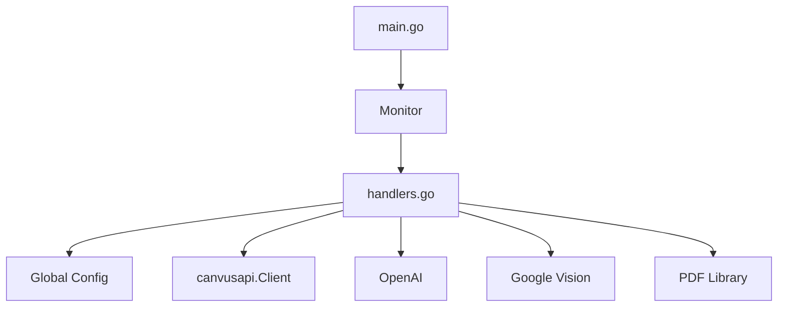
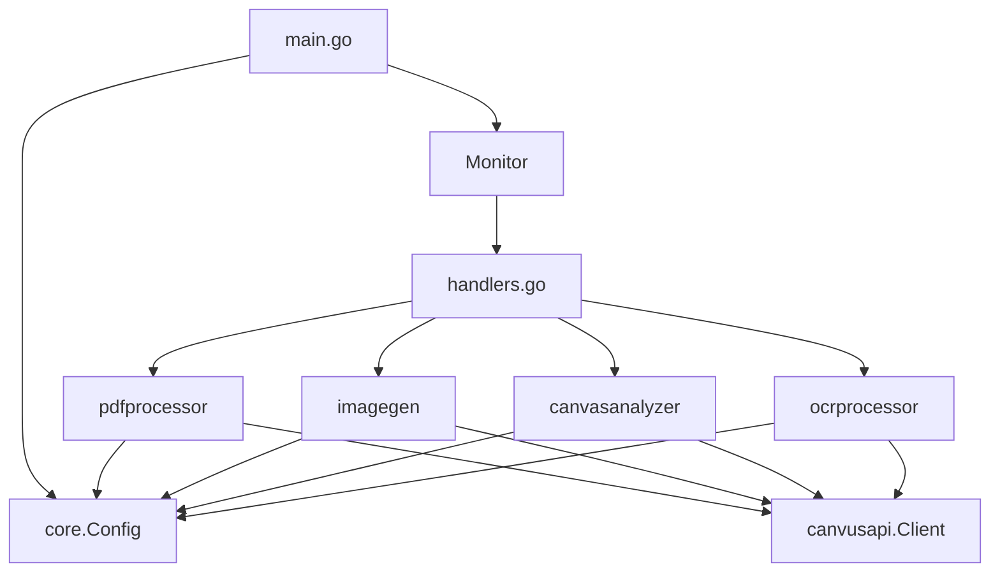

# Architecture Refactoring Specification

**Version:** 1.0
**Status:** Draft
**Owner:** Development Team
**Created:** 2025-12-16

## Table of Contents

1. [Overview](#overview)
2. [Goals and Objectives](#goals-and-objectives)
3. [Current Architecture Analysis](#current-architecture-analysis)
4. [Target Architecture](#target-architecture)
5. [Package Extraction Plans](#package-extraction-plans)
6. [Dependency Injection Strategy](#dependency-injection-strategy)
7. [Atomic Design Mapping](#atomic-design-mapping)
8. [Migration Strategy](#migration-strategy)
9. [Testing Approach](#testing-approach)
10. [Acceptance Criteria](#acceptance-criteria)

---

## 1. Overview

### 1.1 Purpose

This specification defines the architectural refactoring of CanvusLocalLLM's Go backend to achieve:
- Clean atomic design architecture
- Elimination of global state
- Improved modularity and testability
- Better code organization and maintainability

### 1.2 Scope

**In Scope:**
- Extraction of 4 domain packages (pdfprocessor, imagegen, canvasanalyzer, ocrprocessor)
- Elimination of global config variable
- Decomposition of handlers.go into atomic functions
- Dependency injection implementation
- Comprehensive test coverage
- Documentation updates

**Out of Scope:**
- CGo integration with llama.cpp/stable-diffusion.cpp
- Installation and packaging changes
- New features or capabilities
- External API changes
- Configuration format changes

### 1.3 Context

The current codebase has evolved to a point where the main handlers.go file contains ~2100 lines of mixed responsibilities. This creates maintenance challenges, testing difficulties, and violates fundamental design principles. This refactoring addresses these issues without changing external behavior.

### 1.4 Key Stakeholders

- **Development Team:** Implements refactoring
- **QA Team:** Validates functionality preservation
- **DevOps Team:** Ensures deployment compatibility
- **End Users:** Expect zero disruption

---

## 2. Goals and Objectives

### 2.1 Primary Goals

**G1: Clean Atomic Design Architecture**
- Achieve clear separation between atoms, molecules, and organisms
- Maximum function length: 50 lines
- Single Responsibility Principle throughout

**G2: Zero Global State**
- Eliminate all package-level mutable variables
- Dependency injection for all components
- Testable without global setup

**G3: Improved Modularity**
- Domain-specific packages
- Clear package boundaries
- Independent compilation and testing

**G4: Enhanced Testability**
- >80% test coverage overall
- Unit tests for all atoms
- Integration tests for all organisms
- Mocked external dependencies

### 2.2 Success Criteria

**Quantitative:**
- handlers.go: 2100 → <500 lines
- Test coverage: Current → >80%
- Average function length: <30 lines
- Package count: +4 new domain packages

**Qualitative:**
- Code review approval from 2+ developers
- Zero regression bugs in production
- Improved code navigation and comprehension
- Easier onboarding for new developers

### 2.3 Constraints

**Technical:**
- Maintain backward compatibility
- No new external dependencies
- No performance degradation
- Go 1.x compatibility

**Process:**
- Incremental migration approach
- All tests pass at each step
- Main branch always deployable
- Code review for all changes

---

## 3. Current Architecture Analysis

### 3.1 File Structure

```
/home/jaypaulb/Projects/gh/CanvusLocalLLM/
├── main.go (93 lines)
├── handlers.go (2105 lines) ⚠️ PROBLEM
├── monitorcanvus.go (278 lines)
├── core/
│   ├── config.go (237 lines)
│   └── ai.go (55 lines)
├── canvusapi/
│   └── canvusapi.go (~500 lines)
├── logging/
│   └── logging.go (minimal)
└── tests/
    ├── canvas_check_test.go
    ├── llm_test.go
    ├── testAPI_test.go
    └── test_data.go
```

### 3.2 handlers.go Breakdown

**Line Count by Feature Domain:**

| Feature Domain | Lines | Percentage | Functions |
|---------------|-------|------------|-----------|
| Note Processing | 133 | 6% | handleNote, createNoteFromResponse, generateAIResponse |
| PDF Processing | 313 | 15% | handlePDFPrecis, extractPDFText, splitIntoChunks, consolidateSummaries |
| Image Generation | 290 | 14% | processAIImage, processAIImageOpenAI, processAIImageAzure |
| OCR Processing | 370 | 18% | handleSnapshot, performGoogleVisionOCR, performOCR, validateGoogleAPIKey |
| Canvas Analysis | 199 | 9% | handleCanvusPrecis, fetchCanvasWidgets, processCanvusPrecis |
| Utility Functions | 180 | 9% | validateUpdate, updateNoteWithRetry, clearProcessingStatus, etc. |
| Error Handling | 120 | 6% | handleAIError, createProcessingNote, cleanup |
| Supporting Code | 500 | 23% | Type definitions, constants, global variables |

**Total: 2105 lines**

### 3.3 Current Violations

**V1: Global State Violation**
```go
// Line 48 - Global configuration
var config *core.Config
```
- Used by 15+ functions
- Makes testing require global setup
- Hidden dependency
- Thread-safety concerns

**V2: Mixed Abstraction Levels**
```go
// handleNote (132 lines) contains:
// - Low-level string manipulation
// - HTTP API calls
// - AI client configuration
// - Error handling
// - State updates
```

**V3: Tight Coupling**
- PDF processing directly calls canvusapi
- Image generation directly calls canvusapi
- No abstraction layers
- Cannot test in isolation

**V4: Large Functions**
| Function | Lines | Should Be |
|----------|-------|-----------|
| handleNote | 132 | <50 |
| createNoteFromResponse | 144 | <50 |
| handlePDFPrecis | 219 | <50 |
| processCanvusPrecis | 118 | <50 |
| handleSnapshot | 169 | <50 |

**V5: Repeated Patterns**
- Progress note creation: duplicated 4 times
- AI client creation: duplicated 5 times
- Retry logic: duplicated 3 times
- Error handling: inconsistent patterns

### 3.4 Dependency Graph (Current)

```
main.go
  └── Monitor (monitorcanvus.go)
        └── handlers.go (MONOLITH)
              ├── core.Config (global!)
              ├── canvusapi.Client
              ├── OpenAI client
              ├── Google Vision API
              └── PDF library
```

### 3.5 Testing Challenges

**Current Test Coverage:**
- handlers.go: ~10% (difficult due to globals)
- core/config.go: ~40%
- core/ai.go: 0%
- canvusapi/: ~20%
- monitorcanvus.go: 0%

**Why Low Coverage:**
1. Global config makes unit testing difficult
2. Large functions hard to test individually
3. External API calls not mockable
4. No dependency injection
5. Complex setup required

---

## 4. Target Architecture

### 4.1 Package Structure (After Refactoring)

```
/home/jaypaulb/Projects/gh/CanvusLocalLLM/
├── main.go                    # Composition root (Page)
├── handlers.go                # Reduced to <500 lines
├── monitorcanvus.go          # Monitor organism
├── core/                      # Core molecules
│   ├── config.go             # Configuration
│   ├── ai.go                 # AI client factory
│   └── errors.go             # Error types (new)
├── canvusapi/                # Canvus API client (Organism)
│   ├── canvusapi.go
│   └── canvusapi_test.go
├── logging/                   # Logging utility (Atom)
│   ├── logging.go
│   └── logging_test.go
├── pdfprocessor/             # PDF processing (NEW)
│   ├── processor.go          # Main processor organism
│   ├── extractor.go          # Text extraction molecule
│   ├── chunker.go            # Text chunking molecule
│   ├── summarizer.go         # AI summarization molecule
│   ├── errors.go             # Domain errors
│   ├── processor_test.go
│   ├── integration_test.go
│   └── testdata/
│       └── sample.pdf
├── imagegen/                 # Image generation (NEW)
│   ├── generator.go          # Main generator organism
│   ├── openai.go            # OpenAI provider molecule
│   ├── azure.go             # Azure provider molecule
│   ├── downloader.go        # Image download molecule
│   ├── errors.go            # Domain errors
│   ├── generator_test.go
│   └── integration_test.go
├── canvasanalyzer/          # Canvas analysis (NEW)
│   ├── analyzer.go          # Main analyzer organism
│   ├── fetcher.go           # Widget fetcher molecule
│   ├── processor.go         # Analysis processor molecule
│   ├── errors.go            # Domain errors
│   ├── analyzer_test.go
│   └── integration_test.go
├── ocrprocessor/            # OCR processing (NEW)
│   ├── processor.go         # Main processor organism
│   ├── vision.go            # Google Vision client molecule
│   ├── validator.go         # API key validator atom
│   ├── errors.go            # Domain errors
│   ├── processor_test.go
│   └── integration_test.go
└── tests/                    # Integration tests
    ├── canvas_check_test.go
    ├── llm_test.go
    ├── testAPI_test.go
    ├── test_data.go
    └── e2e_test.go (new)
```

### 4.2 Dependency Graph (Target)

```
main.go (Page)
  │
  ├── core.Config ────────────────────┐
  │                                    │
  └── Monitor (Organism)               │
        │                              │
        ├── canvusapi.Client ──────────┤
        │                              │
        └── handlers.go (Coordinator)  │
              │                        │
              ├── pdfprocessor ────────┤
              │     └── Processor      │
              │                        │
              ├── imagegen ────────────┤
              │     └── Generator      │
              │                        │
              ├── canvasanalyzer ──────┤
              │     └── Analyzer       │
              │                        │
              └── ocrprocessor ────────┤
                    └── Processor      │
                                       │
All packages receive Config ───────────┘
(NO GLOBALS)
```

### 4.3 Atomic Design Hierarchy

**Page Level:**
- `main.go` - Composition root, wires everything together

**Organism Level:**
- `Monitor` - Canvas monitoring service
- `pdfprocessor.Processor` - PDF processing workflow
- `imagegen.Generator` - Image generation workflow
- `canvasanalyzer.Analyzer` - Canvas analysis workflow
- `ocrprocessor.Processor` - OCR processing workflow
- `canvusapi.Client` - Canvus API interaction

**Molecule Level:**
- `pdfprocessor.Extractor` - PDF text extraction
- `pdfprocessor.Chunker` - Text chunking
- `pdfprocessor.Summarizer` - AI summarization
- `imagegen.OpenAIProvider` - OpenAI image generation
- `imagegen.AzureProvider` - Azure image generation
- `imagegen.Downloader` - Image download
- `canvasanalyzer.Fetcher` - Widget fetching
- `canvasanalyzer.Processor` - Analysis processing
- `ocrprocessor.VisionClient` - Google Vision API
- `core.Config` - Configuration composition

**Atom Level:**
- `validateUpdate()` - Update validation
- `truncateText()` - Text truncation
- `estimateTokenCount()` - Token estimation
- `getEnvOrDefault()` - Environment variable parsing
- `parseIntEnv()` - Integer parsing
- `ocrprocessor.validateAPIKey()` - API key validation

### 4.4 Interface Definitions

**4.4.1 Progress Reporter Interface**
```go
// core/interfaces.go
package core

type ProgressReporter interface {
    ReportProgress(message string) error
    ReportError(err error) error
    ReportSuccess(message string) error
}
```

**4.4.2 PDF Processor Interface**
```go
// pdfprocessor/processor.go
package pdfprocessor

type Processor interface {
    ProcessPDF(ctx context.Context, req ProcessRequest) (*ProcessResult, error)
}

type ProcessRequest struct {
    PDFID           string
    DownloadPath    string
    TriggerWidget   map[string]interface{}
    ProgressReporter core.ProgressReporter
}

type ProcessResult struct {
    SummaryText string
    ChunkCount  int
    TokensUsed  int64
}
```

**4.4.3 Image Generator Interface**
```go
// imagegen/generator.go
package imagegen

type Generator interface {
    GenerateImage(ctx context.Context, req GenerateRequest) (*GenerateResult, error)
}

type GenerateRequest struct {
    Prompt          string
    TriggerWidget   map[string]interface{}
    ProgressReporter core.ProgressReporter
}

type GenerateResult struct {
    ImagePath    string
    WidgetID     string
    Provider     string
}
```

**4.4.4 Canvas Analyzer Interface**
```go
// canvasanalyzer/analyzer.go
package canvasanalyzer

type Analyzer interface {
    AnalyzeCanvas(ctx context.Context, req AnalyzeRequest) (*AnalyzeResult, error)
}

type AnalyzeRequest struct {
    TriggerWidget    map[string]interface{}
    ProgressReporter core.ProgressReporter
}

type AnalyzeResult struct {
    AnalysisText string
    WidgetCount  int
}
```

**4.4.5 OCR Processor Interface**
```go
// ocrprocessor/processor.go
package ocrprocessor

type Processor interface {
    ProcessImage(ctx context.Context, req ProcessRequest) (*ProcessResult, error)
}

type ProcessRequest struct {
    ImageID          string
    TriggerWidget    map[string]interface{}
    ProgressReporter core.ProgressReporter
}

type ProcessResult struct {
    ExtractedText string
    WidgetID      string
}
```

---

## 5. Package Extraction Plans

### 5.1 pdfprocessor Package

**5.1.1 Package Structure**
```go
// pdfprocessor/processor.go
package pdfprocessor

import (
    "context"
    "go_backend/canvusapi"
    "go_backend/core"
)

// Processor handles PDF analysis workflows
type Processor struct {
    client     *canvusapi.Client
    config     *core.Config
    extractor  *Extractor
    chunker    *Chunker
    summarizer *Summarizer
}

// NewProcessor creates a new PDF processor
func NewProcessor(client *canvusapi.Client, cfg *core.Config) *Processor {
    return &Processor{
        client:     client,
        config:     cfg,
        extractor:  NewExtractor(),
        chunker:    NewChunker(cfg),
        summarizer: NewSummarizer(client, cfg),
    }
}

// ProcessPDF handles complete PDF analysis workflow
func (p *Processor) ProcessPDF(ctx context.Context, req ProcessRequest) (*ProcessResult, error) {
    // Implementation moves from handlePDFPrecis
    // 1. Download PDF
    // 2. Extract text
    // 3. Chunk text
    // 4. Generate summaries
    // 5. Create response note
}
```

**5.1.2 Migration Steps**

**Step 1: Create Package Structure**
```bash
mkdir -p pdfprocessor
touch pdfprocessor/processor.go
touch pdfprocessor/extractor.go
touch pdfprocessor/chunker.go
touch pdfprocessor/summarizer.go
touch pdfprocessor/errors.go
touch pdfprocessor/processor_test.go
```

**Step 2: Extract Text Extraction**
```go
// pdfprocessor/extractor.go
package pdfprocessor

import (
    "fmt"
    "github.com/ledongthuc/pdf"
)

// Extractor handles PDF text extraction
type Extractor struct{}

func NewExtractor() *Extractor {
    return &Extractor{}
}

// Extract extracts all text from a PDF file
func (e *Extractor) Extract(pdfPath string) (string, error) {
    // Move extractPDFText logic here
}
```

**Step 3: Extract Text Chunking**
```go
// pdfprocessor/chunker.go
package pdfprocessor

import (
    "go_backend/core"
)

// Chunker handles text chunking by token count
type Chunker struct {
    config *core.Config
}

func NewChunker(cfg *core.Config) *Chunker {
    return &Chunker{config: cfg}
}

// Chunk splits text into chunks respecting token limits
func (c *Chunker) Chunk(text string) []string {
    // Move splitIntoChunks logic here
}
```

**Step 4: Extract AI Summarization**
```go
// pdfprocessor/summarizer.go
package pdfprocessor

import (
    "context"
    "go_backend/canvusapi"
    "go_backend/core"
)

// Summarizer generates AI summaries from PDF chunks
type Summarizer struct {
    client *canvusapi.Client
    config *core.Config
}

func NewSummarizer(client *canvusapi.Client, cfg *core.Config) *Summarizer {
    return &Summarizer{
        client: client,
        config: cfg,
    }
}

// Summarize generates a summary from text chunks
func (s *Summarizer) Summarize(ctx context.Context, chunks []string) (string, error) {
    // Move AI summarization logic here
}
```

**Step 5: Write Tests**
```go
// pdfprocessor/processor_test.go
package pdfprocessor_test

import (
    "testing"
    "go_backend/pdfprocessor"
)

func TestExtractor_Extract(t *testing.T) {
    tests := []struct {
        name    string
        pdfPath string
        want    string
        wantErr bool
    }{
        {
            name:    "valid PDF",
            pdfPath: "testdata/sample.pdf",
            want:    "expected text",
            wantErr: false,
        },
        {
            name:    "missing file",
            pdfPath: "testdata/missing.pdf",
            wantErr: true,
        },
    }

    for _, tt := range tests {
        t.Run(tt.name, func(t *testing.T) {
            e := pdfprocessor.NewExtractor()
            got, err := e.Extract(tt.pdfPath)
            if (err != nil) != tt.wantErr {
                t.Errorf("Extract() error = %v, wantErr %v", err, tt.wantErr)
                return
            }
            if !tt.wantErr && got != tt.want {
                t.Errorf("Extract() = %v, want %v", got, tt.want)
            }
        })
    }
}
```

**Step 6: Update handlers.go**
```go
// handlers.go
func handlePDFPrecis(update Update, client *canvusapi.Client, config *core.Config) {
    // Create processor
    processor := pdfprocessor.NewProcessor(client, config)

    // Create progress reporter
    reporter := newProgressReporter(client, processingNoteID)

    // Process PDF
    req := pdfprocessor.ProcessRequest{
        PDFID:            parentID,
        DownloadPath:     downloadPath,
        TriggerWidget:    triggerWidget,
        ProgressReporter: reporter,
    }

    result, err := processor.ProcessPDF(ctx, req)
    if err != nil {
        handleError(err)
        return
    }

    // Rest of logic simplified
}
```

### 5.2 imagegen Package

**5.2.1 Package Structure**
```go
// imagegen/generator.go
package imagegen

import (
    "context"
    "go_backend/canvusapi"
    "go_backend/core"
)

// Generator handles AI image generation
type Generator struct {
    client   *canvusapi.Client
    config   *core.Config
    provider Provider
}

// Provider interface for image generation providers
type Provider interface {
    Generate(ctx context.Context, prompt string) (string, error)
}

func NewGenerator(client *canvusapi.Client, cfg *core.Config) *Generator {
    // Determine provider based on config
    var provider Provider
    if isAzureEndpoint(cfg.ImageLLMURL) {
        provider = NewAzureProvider(cfg)
    } else {
        provider = NewOpenAIProvider(cfg)
    }

    return &Generator{
        client:   client,
        config:   cfg,
        provider: provider,
    }
}

func (g *Generator) GenerateImage(ctx context.Context, req GenerateRequest) (*GenerateResult, error) {
    // Implementation moves from processAIImage
}
```

**5.2.2 Provider Implementations**
```go
// imagegen/openai.go
package imagegen

import (
    "context"
    "go_backend/core"
    "github.com/sashabaranov/go-openai"
)

type OpenAIProvider struct {
    client *openai.Client
    config *core.Config
}

func NewOpenAIProvider(cfg *core.Config) *OpenAIProvider {
    // Create OpenAI client
}

func (p *OpenAIProvider) Generate(ctx context.Context, prompt string) (string, error) {
    // Move processAIImageOpenAI logic here
}
```

```go
// imagegen/azure.go
package imagegen

type AzureProvider struct {
    client *openai.Client
    config *core.Config
}

func NewAzureProvider(cfg *core.Config) *AzureProvider {
    // Create Azure client
}

func (p *AzureProvider) Generate(ctx context.Context, prompt string) (string, error) {
    // Move processAIImageAzure logic here
}
```

**5.2.3 Migration Pattern**
Same incremental approach as pdfprocessor:
1. Create package structure
2. Extract provider logic
3. Extract downloader
4. Write unit tests with mocked HTTP
5. Write integration tests
6. Update handlers.go

### 5.3 canvasanalyzer Package

**5.3.1 Package Structure**
```go
// canvasanalyzer/analyzer.go
package canvasanalyzer

import (
    "context"
    "go_backend/canvusapi"
    "go_backend/core"
)

type Analyzer struct {
    client    *canvusapi.Client
    config    *core.Config
    fetcher   *Fetcher
    processor *Processor
}

func NewAnalyzer(client *canvusapi.Client, cfg *core.Config) *Analyzer {
    return &Analyzer{
        client:    client,
        config:    cfg,
        fetcher:   NewFetcher(client, cfg),
        processor: NewProcessor(cfg),
    }
}

func (a *Analyzer) AnalyzeCanvas(ctx context.Context, req AnalyzeRequest) (*AnalyzeResult, error) {
    // Implementation moves from handleCanvusPrecis
}
```

**5.3.2 Components**
```go
// canvasanalyzer/fetcher.go
package canvasanalyzer

// Fetcher retrieves canvas widgets with retry logic
type Fetcher struct {
    client *canvusapi.Client
    config *core.Config
}

func (f *Fetcher) FetchWidgets(ctx context.Context, excludeID string) ([]map[string]interface{}, error) {
    // Move fetchCanvasWidgets logic here
}
```

```go
// canvasanalyzer/processor.go
package canvasanalyzer

// Processor generates AI analysis from widgets
type Processor struct {
    config *core.Config
}

func (p *Processor) ProcessWidgets(ctx context.Context, widgets []map[string]interface{}) (string, error) {
    // Move processCanvusPrecis logic here
}
```

### 5.4 ocrprocessor Package

**5.4.1 Package Structure**
```go
// ocrprocessor/processor.go
package ocrprocessor

import (
    "context"
    "go_backend/canvusapi"
    "go_backend/core"
)

type Processor struct {
    client    *canvusapi.Client
    config    *core.Config
    vision    *VisionClient
    validator *Validator
}

func NewProcessor(client *canvusapi.Client, cfg *core.Config) *Processor {
    return &Processor{
        client:    client,
        config:    cfg,
        vision:    NewVisionClient(cfg),
        validator: NewValidator(cfg),
    }
}

func (p *Processor) ProcessImage(ctx context.Context, req ProcessRequest) (*ProcessResult, error) {
    // Implementation moves from handleSnapshot
}
```

**5.4.2 Components**
```go
// ocrprocessor/vision.go
package ocrprocessor

// VisionClient wraps Google Vision API
type VisionClient struct {
    config *core.Config
    client *http.Client
}

func (v *VisionClient) PerformOCR(ctx context.Context, imageData []byte) (string, error) {
    // Move performGoogleVisionOCR logic here
}
```

```go
// ocrprocessor/validator.go
package ocrprocessor

// Validator validates Google Vision API keys
type Validator struct {
    config *core.Config
}

func (v *Validator) ValidateAPIKey(ctx context.Context) error {
    // Move validateGoogleAPIKey logic here
}
```

---

## 6. Dependency Injection Strategy

### 6.1 Current Problem

```go
// handlers.go - Line 48
var config *core.Config  // GLOBAL STATE!

// Used in 15+ functions:
func Cleanup() {
    if err := CleanupDownloads(); err != nil {
        logHandler("Error: %v", err)
    }
}

func CleanupDownloads() error {
    pattern := filepath.Join(config.DownloadsDir, "temp_*")  // Uses global!
    // ...
}
```

### 6.2 Solution: Constructor Injection

**Step 1: Update Monitor to Store Config**
```go
// monitorcanvus.go
type Monitor struct {
    client     *canvusapi.Client
    config     *core.Config  // Store config here
    done       chan struct{}
    widgets    map[string]map[string]interface{}
    widgetsMux sync.RWMutex
}

func NewMonitor(client *canvusapi.Client, cfg *core.Config) *Monitor {
    return &Monitor{
        client:     client,
        config:     cfg,  // Inject via constructor
        done:       make(chan struct{}),
        widgets:    make(map[string]map[string]interface{}),
        widgetsMux: sync.RWMutex{},
    }
}
```

**Step 2: Pass Config to All Handler Functions**
```go
// Before:
func handleNote(update Update, client *canvusapi.Client, config *core.Config)

// Already correct! Just remove global usage

// Before:
func Cleanup() {
    CleanupDownloads()  // Uses global config
}

// After:
func Cleanup(cfg *core.Config) {
    CleanupDownloads(cfg)  // Pass config explicitly
}

func CleanupDownloads(cfg *core.Config) error {
    pattern := filepath.Join(cfg.DownloadsDir, "temp_*")  // Use parameter
    // ...
}
```

**Step 3: Remove Global Variable**
```go
// handlers.go
// DELETE THIS LINE:
// var config *core.Config

// All functions now receive config as parameter
```

**Step 4: Update main.go**
```go
// main.go
func main() {
    // Load configuration
    config, err := core.LoadConfig()
    if err != nil {
        log.Fatalf("Failed to load config: %v", err)
    }

    // Create client with config
    client := canvusapi.NewClient(
        config.CanvusServerURL,
        config.CanvasID,
        config.CanvusAPIKey,
        config.AllowSelfSignedCerts,
    )

    // Create monitor with injected dependencies
    monitor := NewMonitor(client, config)

    // Cleanup on shutdown with config
    defer Cleanup(config)

    // Start monitoring
    go monitor.Start(ctx)
    <-ctx.Done()
}
```

### 6.3 Dependency Injection Patterns

**Pattern 1: Constructor Injection (Preferred)**
```go
// Inject all dependencies via constructor
type Processor struct {
    client *canvusapi.Client
    config *core.Config
}

func NewProcessor(client *canvusapi.Client, cfg *core.Config) *Processor {
    return &Processor{
        client: client,
        config: cfg,
    }
}
```

**Pattern 2: Method Injection (For Context-Specific Deps)**
```go
// Inject context per method call
func (p *Processor) ProcessPDF(ctx context.Context, req ProcessRequest) (*ProcessResult, error) {
    // ctx provides cancellation, not stored
}
```

**Pattern 3: Interface Injection (For Testability)**
```go
// Inject interfaces, not concrete types
type Processor struct {
    client     APIClient      // Interface, not *canvusapi.Client
    config     *core.Config
    reporter   ProgressReporter  // Interface
}
```

### 6.4 Migration Checklist

- [ ] Add config field to Monitor struct
- [ ] Update Monitor constructor to accept config
- [ ] Update all handler function signatures to accept config
- [ ] Update all handler function calls to pass config
- [ ] Update Cleanup and CleanupDownloads signatures
- [ ] Update main.go to call Cleanup(config)
- [ ] Remove global config variable
- [ ] Verify all tests pass
- [ ] Run race detector: `go test -race ./...`

---

## 7. Atomic Design Mapping

### 7.1 Hierarchy Definition

**Page → Organism → Molecule → Atom**

### 7.2 Current Code Classification

**Atoms (Pure Functions - No Dependencies):**
```go
// Already atoms:
func truncateText(text string, length int) string
func estimateTokenCount(text string) int
func getEnvOrDefault(key, defaultValue string) string
func parseIntEnv(key string, defaultValue int) int
func validateUpdate(update Update) error

// Should be atoms:
func roundLocation(loc map[string]interface{})
func calculateNoteSize(content string, originalSize map[string]interface{}) map[string]interface{}
func extractJSONFromResponse(rawResponse string) (string, error)
```

**Molecules (Simple Compositions - 2-3 Atoms):**
```go
// Already molecules:
func updateNoteWithRetry(client, noteID, payload, config)
func clearProcessingStatus(client, noteID, text, config)
func getAbsoluteLocation(client, widget, config)
func createProcessingNote(client, update, config)

// Should be molecules:
func createAIClient(config) *openai.Client
func downloadFile(url, destPath string, config) error
func uploadImageWidget(imagePath string, payload map[string]interface{}, client) error
```

**Organisms (Complex Units - Feature Completion):**
```go
// Already organisms:
func handleNote(update, client, config)
func handlePDFPrecis(update, client, config)
func handleSnapshot(update, client, config)
func handleCanvusPrecis(update, client, config)

// New organisms (after extraction):
pdfprocessor.Processor
imagegen.Generator
canvasanalyzer.Analyzer
ocrprocessor.Processor
canvusapi.Client
Monitor
```

**Pages (Composition Roots):**
```go
// Already a page:
main.go - wires everything together
```

### 7.3 Extraction Examples

**Example 1: Extract Atom from Organism**

**Before:**
```go
// Inside handleNote (132 lines)
func handleNote(update Update, client *canvusapi.Client, config *core.Config) {
    // ... 20 lines ...

    // Embedded text truncation logic
    textPreview := noteText
    if len(noteText) > 30 {
        textPreview = noteText[:30]
    }
    logHandler("Processing: %s", textPreview)

    // ... 100 more lines ...
}
```

**After:**
```go
// Atom: Pure function, no dependencies
func truncateText(text string, maxLen int) string {
    if len(text) > maxLen {
        return text[:maxLen]
    }
    return text
}

// Organism: Uses atom
func handleNote(update Update, client *canvusapi.Client, config *core.Config) {
    // ... 20 lines ...

    textPreview := truncateText(noteText, 30)
    logHandler("Processing: %s", textPreview)

    // ... simpler remaining logic ...
}
```

**Example 2: Extract Molecule from Organism**

**Before:**
```go
// Inside handleNote
func handleNote(update Update, client *canvusapi.Client, config *core.Config) {
    // ... 50 lines ...

    // Embedded AI client creation
    clientConfig := openai.DefaultConfig(config.OpenAIAPIKey)
    if config.TextLLMURL != "" {
        clientConfig.BaseURL = config.TextLLMURL
    } else if config.BaseLLMURL != "" {
        clientConfig.BaseURL = config.BaseLLMURL
    }
    clientConfig.HTTPClient = core.GetHTTPClient(config, config.AITimeout)
    aiClient := openai.NewClientWithConfig(clientConfig)

    // ... 60 more lines ...
}
```

**After:**
```go
// Molecule: Composes atoms into reusable unit
func createAIClient(cfg *core.Config) *openai.Client {
    clientConfig := openai.DefaultConfig(cfg.OpenAIAPIKey)

    baseURL := selectBaseURL(cfg)  // Atom
    clientConfig.BaseURL = baseURL

    clientConfig.HTTPClient = core.GetHTTPClient(cfg, cfg.AITimeout)
    return openai.NewClientWithConfig(clientConfig)
}

// Atom: URL selection logic
func selectBaseURL(cfg *core.Config) string {
    if cfg.TextLLMURL != "" {
        return cfg.TextLLMURL
    }
    if cfg.BaseLLMURL != "" {
        return cfg.BaseLLMURL
    }
    return "https://api.openai.com/v1"
}

// Organism: Uses molecule
func handleNote(update Update, client *canvusapi.Client, config *core.Config) {
    // ... 50 lines ...

    aiClient := createAIClient(config)

    // ... simpler remaining logic ...
}
```

**Example 3: Extract Organism to Package**

**Before:**
```go
// handlers.go - 220 lines
func handlePDFPrecis(update Update, client *canvusapi.Client, config *core.Config) {
    // Download PDF
    downloadPath := filepath.Join(config.DownloadsDir, fmt.Sprintf("temp_pdf_%s.pdf", parentID))
    if err := client.DownloadPDF(parentID, downloadPath); err != nil {
        // error handling
    }
    defer os.Remove(downloadPath)

    // Extract text
    pdfText, err := extractPDFText(downloadPath)
    if err != nil {
        // error handling
    }

    // Chunk text
    chunks := splitIntoChunks(pdfText, int(config.PDFChunkSizeTokens))

    // Generate AI summary
    // ... 150 more lines ...
}

func extractPDFText(pdfPath string) (string, error) {
    // ... 35 lines ...
}

func splitIntoChunks(text string, maxChunkSize int) []string {
    // ... 28 lines ...
}
```

**After:**
```go
// handlers.go - 30 lines
func handlePDFPrecis(update Update, client *canvusapi.Client, config *core.Config) {
    processor := pdfprocessor.NewProcessor(client, config)
    reporter := newProgressReporter(client, processingNoteID)

    req := pdfprocessor.ProcessRequest{
        PDFID:            parentID,
        TriggerWidget:    triggerWidget,
        ProgressReporter: reporter,
    }

    result, err := processor.ProcessPDF(ctx, req)
    if err != nil {
        handleError(err)
        return
    }

    // Create response note
    createResponseNote(result.SummaryText, triggerWidget, client, config)
}

// pdfprocessor/processor.go - Organism
type Processor struct {
    client     *canvusapi.Client
    config     *core.Config
    extractor  *Extractor   // Molecule
    chunker    *Chunker     // Molecule
    summarizer *Summarizer  // Molecule
}

func (p *Processor) ProcessPDF(ctx context.Context, req ProcessRequest) (*ProcessResult, error) {
    // Orchestrates molecules
    text, err := p.extractor.Extract(downloadPath)
    chunks := p.chunker.Chunk(text)
    summary, err := p.summarizer.Summarize(ctx, chunks)
    return &ProcessResult{SummaryText: summary}, nil
}
```

### 7.4 Atomic Design Benefits

**Testability:**
- **Atoms:** Unit test with table-driven tests
- **Molecules:** Unit test with minimal mocking
- **Organisms:** Integration test with mocked APIs
- **Pages:** E2E tests

**Reusability:**
- Atoms reusable across packages
- Molecules reusable within domain
- Organisms specific to feature

**Comprehension:**
- Clear abstraction levels
- Easy to navigate codebase
- Obvious dependencies

---

## 8. Migration Strategy

### 8.1 Overall Approach

**Phase-Based Migration:**
1. Phase 1: Eliminate global config (2 days)
2. Phase 2: Extract utility atoms/molecules (2 days)
3. Phase 3: Extract pdfprocessor (3 days)
4. Phase 4: Extract imagegen (3 days)
5. Phase 5: Extract canvasanalyzer (2 days)
6. Phase 6: Extract ocrprocessor (3 days)
7. Phase 7: Final cleanup and documentation (2 days)

**Total Estimated Duration: 17 days**

### 8.2 Phase 1: Eliminate Global Config (Days 1-2)

**Day 1: Update Monitor and Handler Signatures**

**Tasks:**
1. Add config field to Monitor struct
2. Update Monitor constructor
3. Update all handler function calls in Monitor
4. Update Cleanup functions
5. Run tests

**Changes:**
```go
// monitorcanvus.go
type Monitor struct {
    client     *canvusapi.Client
    config     *core.Config  // ADD THIS
    done       chan struct{}
    widgets    map[string]map[string]interface{}
    widgetsMux sync.RWMutex
}

func NewMonitor(client *canvusapi.Client, cfg *core.Config) *Monitor {
    return &Monitor{
        client:     client,
        config:     cfg,  // INJECT HERE
        done:       make(chan struct{}),
        widgets:    make(map[string]map[string]interface{}),
        widgetsMux: sync.RWMutex{},
    }
}

func (m *Monitor) routeUpdate(update Update) error {
    switch update["widget_type"].(string) {
    case "Note":
        go handleNote(update, m.client, m.config)  // PASS CONFIG
    case "Image":
        // ... similar updates
    }
    return nil
}
```

**Day 2: Remove Global and Update main.go**

**Tasks:**
1. Remove global config variable
2. Update main.go to inject config
3. Update all cleanup calls
4. Run full test suite
5. Manual testing

**Changes:**
```go
// handlers.go
// DELETE: var config *core.Config

// Update cleanup functions
func Cleanup(cfg *core.Config) {
    if err := CleanupDownloads(cfg); err != nil {
        logHandler("Error: %v", err)
    }
}

func CleanupDownloads(cfg *core.Config) error {
    pattern := filepath.Join(cfg.DownloadsDir, "temp_*")
    // ...
}

// main.go
func main() {
    config, err := core.LoadConfig()
    // ...

    monitor := NewMonitor(client, config)
    defer Cleanup(config)  // PASS CONFIG

    go monitor.Start(ctx)
    <-ctx.Done()
}
```

**Verification:**
- [ ] All tests pass
- [ ] No compilation errors
- [ ] No global variables in handlers.go
- [ ] Manual test: Note processing works
- [ ] Manual test: PDF processing works
- [ ] Manual test: Image generation works

### 8.3 Phase 2: Extract Utility Atoms/Molecules (Days 3-4)

**Day 3: Extract Atoms**

**Tasks:**
1. Create `utils` package for shared atoms
2. Move pure functions
3. Update imports
4. Write unit tests

**Atoms to Extract:**
```go
// utils/text.go
package utils

func TruncateText(text string, maxLen int) string {
    if len(text) > maxLen {
        return text[:maxLen]
    }
    return text
}

func EstimateTokenCount(text string) int {
    return len(text) / 4
}

// utils/validation.go
package utils

func ValidateUpdate(update map[string]interface{}) error {
    id, hasID := update["id"].(string)
    if !hasID || id == "" {
        return fmt.Errorf("missing or empty ID")
    }
    // ... rest of validation
}
```

**Day 4: Extract Molecules**

**Tasks:**
1. Create molecule helpers
2. Extract repeated patterns
3. Write unit tests
4. Update handlers to use molecules

**Molecules to Extract:**
```go
// handlers/molecules.go (or keep in handlers.go)
package main

import (
    "go_backend/canvusapi"
    "go_backend/core"
)

// NoteUpdater handles note updates with retry logic
type NoteUpdater struct {
    client *canvusapi.Client
    config *core.Config
}

func NewNoteUpdater(client *canvusapi.Client, cfg *core.Config) *NoteUpdater {
    return &NoteUpdater{client: client, config: cfg}
}

func (nu *NoteUpdater) UpdateWithRetry(noteID string, payload map[string]interface{}) error {
    // Move updateNoteWithRetry logic here
}

// AIClientFactory creates configured AI clients
type AIClientFactory struct {
    config *core.Config
}

func NewAIClientFactory(cfg *core.Config) *AIClientFactory {
    return &AIClientFactory{config: cfg}
}

func (f *AIClientFactory) CreateClient() *openai.Client {
    // Move AI client creation logic here
}
```

**Verification:**
- [ ] All utility tests pass
- [ ] Handlers use new utilities
- [ ] No duplicated code
- [ ] Coverage >80% for utils

### 8.4 Phase 3: Extract pdfprocessor (Days 5-7)

**Day 5: Create Package Structure**

**Tasks:**
1. Create package directory
2. Define interfaces
3. Create processor.go skeleton
4. Write basic tests

```bash
mkdir -p pdfprocessor/testdata
touch pdfprocessor/processor.go
touch pdfprocessor/extractor.go
touch pdfprocessor/chunker.go
touch pdfprocessor/summarizer.go
touch pdfprocessor/errors.go
touch pdfprocessor/processor_test.go
touch pdfprocessor/integration_test.go
```

**Day 6: Implement Components**

**Tasks:**
1. Implement Extractor
2. Implement Chunker
3. Implement Summarizer
4. Write unit tests for each

**Day 7: Integration and Testing**

**Tasks:**
1. Implement Processor orchestration
2. Write integration tests
3. Update handlers.go to use processor
4. Manual testing
5. Performance testing

**Verification:**
- [ ] Package compiles independently
- [ ] Unit tests pass (>80% coverage)
- [ ] Integration tests pass
- [ ] PDF processing works identically
- [ ] No performance regression

### 8.5 Phase 4: Extract imagegen (Days 8-10)

**Same pattern as pdfprocessor:**
- Day 8: Package structure and interfaces
- Day 9: Implement providers and downloader
- Day 10: Integration, testing, handlers update

**Key Components:**
1. Generator organism
2. OpenAIProvider molecule
3. AzureProvider molecule
4. Downloader molecule
5. Provider interface

**Verification:**
- [ ] OpenAI generation works
- [ ] Azure generation works
- [ ] Provider auto-detection works
- [ ] Unit tests pass (>80% coverage)
- [ ] Integration tests pass

### 8.6 Phase 5: Extract canvasanalyzer (Days 11-12)

**Same pattern:**
- Day 11: Package structure and implementation
- Day 12: Testing and integration

**Key Components:**
1. Analyzer organism
2. Fetcher molecule
3. Processor molecule

**Verification:**
- [ ] Canvas analysis works
- [ ] Widget filtering works
- [ ] Unit tests pass (>80% coverage)
- [ ] Integration tests pass

### 8.7 Phase 6: Extract ocrprocessor (Days 13-15)

**Same pattern:**
- Day 13: Package structure
- Day 14: Implementation
- Day 15: Testing and integration

**Key Components:**
1. Processor organism
2. VisionClient molecule
3. Validator atom

**Verification:**
- [ ] OCR processing works
- [ ] API key validation works
- [ ] Unit tests pass (>80% coverage)
- [ ] Integration tests pass

### 8.8 Phase 7: Final Cleanup (Days 16-17)

**Day 16: Code Cleanup**

**Tasks:**
1. Remove unused code
2. Standardize error handling
3. Add godoc comments
4. Update CLAUDE.md
5. Code review

**Day 17: Documentation and QA**

**Tasks:**
1. Write migration guide
2. Update README
3. Full regression testing
4. Performance benchmarking
5. Final code review

**Final Verification:**
- [ ] All packages documented
- [ ] All tests pass
- [ ] Coverage >80% overall
- [ ] No performance regression
- [ ] Code review approved
- [ ] Ready for production

### 8.9 Rollback Plan

**If Issues Discovered:**

**Minor Issues:**
- Fix forward in same PR
- Add tests for discovered edge cases

**Major Issues:**
- Revert specific package extraction
- Keep previous phase changes
- Diagnose and fix
- Re-attempt extraction

**Critical Issues:**
- Full rollback to pre-refactoring state
- Root cause analysis
- Revised migration plan
- Re-start with lessons learned

**Safety Measures:**
- Each phase is a separate commit
- Tag each stable state
- Maintain parallel branch for testing
- Gradual rollout to production

---

## 9. Testing Approach

### 9.1 Test Strategy

**Test Pyramid:**
```
        E2E Tests (5%)
           /\
          /  \
         /    \
    Integration Tests (25%)
       /        \
      /          \
     /            \
  Unit Tests (70%)
```

### 9.2 Unit Testing

**9.2.1 Atoms Testing**

**Example: Text Utilities**
```go
// utils/text_test.go
package utils_test

import "testing"

func TestTruncateText(t *testing.T) {
    tests := []struct {
        name   string
        text   string
        maxLen int
        want   string
    }{
        {
            name:   "text shorter than limit",
            text:   "short",
            maxLen: 10,
            want:   "short",
        },
        {
            name:   "text longer than limit",
            text:   "this is a very long text",
            maxLen: 10,
            want:   "this is a ",
        },
        {
            name:   "text exactly at limit",
            text:   "exact",
            maxLen: 5,
            want:   "exact",
        },
        {
            name:   "empty text",
            text:   "",
            maxLen: 10,
            want:   "",
        },
    }

    for _, tt := range tests {
        t.Run(tt.name, func(t *testing.T) {
            got := utils.TruncateText(tt.text, tt.maxLen)
            if got != tt.want {
                t.Errorf("TruncateText() = %q, want %q", got, tt.want)
            }
        })
    }
}
```

**9.2.2 Molecules Testing**

**Example: PDF Chunker**
```go
// pdfprocessor/chunker_test.go
package pdfprocessor_test

import (
    "testing"
    "go_backend/core"
    "go_backend/pdfprocessor"
)

func TestChunker_Chunk(t *testing.T) {
    cfg := &core.Config{
        PDFChunkSizeTokens: 100,
    }

    tests := []struct {
        name      string
        text      string
        wantChunks int
    }{
        {
            name:      "text fits in one chunk",
            text:      strings.Repeat("word ", 20), // ~80 chars
            wantChunks: 1,
        },
        {
            name:      "text requires multiple chunks",
            text:      strings.Repeat("word ", 100), // ~400 chars
            wantChunks: 2,
        },
    }

    for _, tt := range tests {
        t.Run(tt.name, func(t *testing.T) {
            chunker := pdfprocessor.NewChunker(cfg)
            chunks := chunker.Chunk(tt.text)

            if len(chunks) != tt.wantChunks {
                t.Errorf("Chunk() returned %d chunks, want %d", len(chunks), tt.wantChunks)
            }
        })
    }
}
```

**9.2.3 Organisms Testing (with Mocks)**

**Example: PDF Processor**
```go
// pdfprocessor/processor_test.go
package pdfprocessor_test

import (
    "context"
    "testing"
    "go_backend/pdfprocessor"
    "go_backend/mocks" // Mock package
)

func TestProcessor_ProcessPDF(t *testing.T) {
    // Create mocks
    mockClient := mocks.NewMockCanvusClient()
    mockConfig := &core.Config{
        PDFChunkSizeTokens: 100,
        OpenAIPDFModel: "gpt-4",
    }

    // Setup mock expectations
    mockClient.On("DownloadPDF", "pdf123", mock.Anything).Return(nil)
    mockClient.On("CreateNote", mock.Anything).Return(map[string]interface{}{
        "id": "note456",
    }, nil)

    // Create processor
    processor := pdfprocessor.NewProcessor(mockClient, mockConfig)

    // Test
    req := pdfprocessor.ProcessRequest{
        PDFID: "pdf123",
        TriggerWidget: map[string]interface{}{
            "id": "trigger789",
        },
        ProgressReporter: &mockProgressReporter{},
    }

    result, err := processor.ProcessPDF(context.Background(), req)

    // Assertions
    if err != nil {
        t.Fatalf("ProcessPDF() error = %v", err)
    }
    if result.SummaryText == "" {
        t.Error("ProcessPDF() returned empty summary")
    }

    // Verify mock expectations
    mockClient.AssertExpectations(t)
}
```

### 9.3 Integration Testing

**9.3.1 Package Integration Tests**

**Example: PDF Processor Integration**
```go
// pdfprocessor/integration_test.go
// +build integration

package pdfprocessor_test

import (
    "context"
    "os"
    "testing"
    "go_backend/canvusapi"
    "go_backend/core"
    "go_backend/pdfprocessor"
)

func TestProcessPDF_Integration(t *testing.T) {
    // Skip if not integration test run
    if os.Getenv("INTEGRATION_TESTS") != "true" {
        t.Skip("Skipping integration test")
    }

    // Load real config
    cfg, err := core.LoadConfig()
    if err != nil {
        t.Fatalf("Failed to load config: %v", err)
    }

    // Create real client
    client := canvusapi.NewClient(
        cfg.CanvusServerURL,
        cfg.CanvasID,
        cfg.CanvusAPIKey,
        cfg.AllowSelfSignedCerts,
    )

    // Create processor
    processor := pdfprocessor.NewProcessor(client, cfg)

    // Test with real PDF
    req := pdfprocessor.ProcessRequest{
        PDFID: "test-pdf-id",
        TriggerWidget: map[string]interface{}{
            "id": "test-trigger",
            "location": map[string]interface{}{"x": 0.0, "y": 0.0},
            "size": map[string]interface{}{"width": 400.0, "height": 300.0},
        },
        ProgressReporter: &testProgressReporter{t: t},
    }

    result, err := processor.ProcessPDF(context.Background(), req)

    if err != nil {
        t.Fatalf("ProcessPDF() error = %v", err)
    }

    t.Logf("Successfully processed PDF: %d chunks, summary length %d",
        result.ChunkCount, len(result.SummaryText))
}

type testProgressReporter struct {
    t *testing.T
}

func (r *testProgressReporter) ReportProgress(msg string) error {
    r.t.Logf("Progress: %s", msg)
    return nil
}

func (r *testProgressReporter) ReportError(err error) error {
    r.t.Logf("Error: %v", err)
    return nil
}

func (r *testProgressReporter) ReportSuccess(msg string) error {
    r.t.Logf("Success: %s", msg)
    return nil
}
```

### 9.4 End-to-End Testing

**9.4.1 Complete Workflow Tests**

**Example: Note Processing E2E**
```go
// tests/e2e_test.go
// +build e2e

package tests

import (
    "context"
    "os"
    "testing"
    "time"
)

func TestNoteProcessing_E2E(t *testing.T) {
    if os.Getenv("E2E_TESTS") != "true" {
        t.Skip("Skipping E2E test")
    }

    // Setup: Create test canvas
    // ...

    // Create note with AI trigger
    note := createTestNote(t, "{{ Generate a poem about clouds }}")

    // Wait for processing
    time.Sleep(5 * time.Second)

    // Verify: Response note created
    widgets := getCanvasWidgets(t)
    responseNote := findResponseNote(widgets, note.ID)

    if responseNote == nil {
        t.Fatal("Response note not created")
    }

    if !containsPoem(responseNote.Text) {
        t.Error("Response doesn't contain expected poem")
    }

    // Cleanup
    deleteWidget(t, note.ID)
    deleteWidget(t, responseNote.ID)
}
```

### 9.5 Test Coverage Goals

**Overall Coverage: >80%**

**Per-Package Coverage:**
| Package | Target Coverage | Priority |
|---------|----------------|----------|
| utils | 90% | High |
| pdfprocessor | 85% | High |
| imagegen | 85% | High |
| canvasanalyzer | 85% | High |
| ocrprocessor | 85% | High |
| core | 90% | High |
| canvusapi | 75% | Medium |
| main | 70% | Medium |
| monitorcanvus | 80% | High |

### 9.6 Test Execution Strategy

**Local Development:**
```bash
# Unit tests (fast, run frequently)
go test ./... -v

# With coverage
go test ./... -cover -coverprofile=coverage.out
go tool cover -html=coverage.out

# Race detection
go test ./... -race

# Integration tests (slower, run before commit)
INTEGRATION_TESTS=true go test ./... -tags=integration -v

# E2E tests (slowest, run before PR)
E2E_TESTS=true go test ./... -tags=e2e -v -timeout=10m
```

**CI/CD Pipeline:**
```yaml
# .github/workflows/test.yml
name: Tests

on: [push, pull_request]

jobs:
  unit-tests:
    runs-on: ubuntu-latest
    steps:
      - uses: actions/checkout@v2
      - uses: actions/setup-go@v2
        with:
          go-version: '1.x'
      - run: go test ./... -v -cover
      - run: go test ./... -race

  integration-tests:
    runs-on: ubuntu-latest
    steps:
      - uses: actions/checkout@v2
      - uses: actions/setup-go@v2
      - run: INTEGRATION_TESTS=true go test ./... -tags=integration -v

  e2e-tests:
    runs-on: ubuntu-latest
    needs: [unit-tests, integration-tests]
    steps:
      - uses: actions/checkout@v2
      - uses: actions/setup-go@v2
      - run: E2E_TESTS=true go test ./... -tags=e2e -v -timeout=10m
```

### 9.7 Mock Strategy

**Mock Interfaces:**
```go
// mocks/canvus_client.go
package mocks

type MockCanvusClient struct {
    mock.Mock
}

func (m *MockCanvusClient) GetWidget(id string, subscribe bool) (map[string]interface{}, error) {
    args := m.Called(id, subscribe)
    return args.Get(0).(map[string]interface{}), args.Error(1)
}

func (m *MockCanvusClient) CreateNote(payload map[string]interface{}) (map[string]interface{}, error) {
    args := m.Called(payload)
    return args.Get(0).(map[string]interface{}), args.Error(1)
}

// ... other methods
```

**Using Mocks in Tests:**
```go
func TestSomething(t *testing.T) {
    mockClient := mocks.NewMockCanvusClient()

    // Setup expectations
    mockClient.On("CreateNote", mock.MatchedBy(func(payload map[string]interface{}) bool {
        return payload["text"] == "expected text"
    })).Return(map[string]interface{}{"id": "note123"}, nil)

    // Use mock
    result, err := functionUnderTest(mockClient)

    // Verify
    mockClient.AssertExpectations(t)
}
```

---

## 10. Acceptance Criteria

### 10.1 Functional Acceptance Criteria

**FAC1: Feature Parity**
- [ ] All existing features work identically
- [ ] Note processing with AI triggers
- [ ] PDF analysis and summarization
- [ ] Image generation (OpenAI and Azure)
- [ ] Canvas analysis
- [ ] OCR processing with Google Vision
- [ ] No user-facing changes or regressions

**FAC2: API Compatibility**
- [ ] Canvus API interactions unchanged
- [ ] OpenAI API calls unchanged
- [ ] Google Vision API calls unchanged
- [ ] Same error messages returned

**FAC3: Configuration**
- [ ] All environment variables work as before
- [ ] No new required configuration
- [ ] Backward compatible with existing .env files

### 10.2 Technical Acceptance Criteria

**TAC1: Code Organization**
- [ ] handlers.go reduced from ~2100 to <500 lines
- [ ] 4 new domain packages created and functional
- [ ] Clear atomic design hierarchy evident
- [ ] No functions exceed 50 lines

**TAC2: Global State Elimination**
- [ ] Zero package-level mutable variables
- [ ] All dependencies injected via constructors
- [ ] Config passed as parameter to all functions
- [ ] No global setup required for tests

**TAC3: Package Structure**
- [ ] pdfprocessor package compiles independently
- [ ] imagegen package compiles independently
- [ ] canvasanalyzer package compiles independently
- [ ] ocrprocessor package compiles independently
- [ ] Clear package boundaries and interfaces

**TAC4: Dependency Injection**
- [ ] Monitor struct contains config field
- [ ] All organisms receive dependencies via constructor
- [ ] No hidden dependencies
- [ ] Easy to substitute mocks for testing

### 10.3 Quality Acceptance Criteria

**QAC1: Test Coverage**
- [ ] Overall coverage >80%
- [ ] pdfprocessor coverage >85%
- [ ] imagegen coverage >85%
- [ ] canvasanalyzer coverage >85%
- [ ] ocrprocessor coverage >85%
- [ ] All new packages have unit tests
- [ ] Integration tests for major workflows
- [ ] E2E tests pass

**QAC2: Documentation**
- [ ] Godoc comments for all exported types
- [ ] Godoc comments for all exported functions
- [ ] Package-level documentation
- [ ] README updated with new architecture
- [ ] CLAUDE.md updated with refactoring notes
- [ ] Migration guide created

**QAC3: Code Quality**
- [ ] All linters pass (golint, go vet)
- [ ] No race conditions (go test -race passes)
- [ ] Cyclomatic complexity <10 per function
- [ ] Code review approved by 2+ developers
- [ ] No TODOs or FIXMEs in production code

### 10.4 Performance Acceptance Criteria

**PAC1: Processing Speed**
- [ ] Note processing time unchanged (±5%)
- [ ] PDF processing time unchanged (±5%)
- [ ] Image generation time unchanged (±5%)
- [ ] Canvas analysis time unchanged (±5%)
- [ ] OCR processing time unchanged (±5%)

**PAC2: Resource Usage**
- [ ] Memory usage unchanged (±10%)
- [ ] Concurrent processing capacity unchanged
- [ ] No goroutine leaks
- [ ] No memory leaks

**PAC3: Benchmarks**
- [ ] Benchmark suite created for critical paths
- [ ] All benchmarks within acceptable range
- [ ] Performance regression tests in CI

### 10.5 Process Acceptance Criteria

**PROC1: Migration Completion**
- [ ] All 7 migration phases completed
- [ ] Each phase documented and committed
- [ ] No temporary code or commented-out sections
- [ ] Clean git history with meaningful commits

**PROC2: Testing**
- [ ] All unit tests pass
- [ ] All integration tests pass
- [ ] All E2E tests pass
- [ ] Manual testing completed
- [ ] QA sign-off received

**PROC3: Deployment Readiness**
- [ ] Staging environment tested
- [ ] Production deployment plan reviewed
- [ ] Rollback plan documented
- [ ] Monitoring in place
- [ ] Ready for production deployment

### 10.6 Sign-Off Checklist

**Technical Lead:**
- [ ] Architecture review completed
- [ ] Code quality acceptable
- [ ] Test coverage adequate
- [ ] Documentation complete

**QA Lead:**
- [ ] All test plans executed
- [ ] No critical bugs found
- [ ] Performance acceptable
- [ ] Ready for production

**DevOps Lead:**
- [ ] Deployment plan reviewed
- [ ] Rollback plan acceptable
- [ ] Monitoring configured
- [ ] CI/CD pipeline updated

**Product Owner:**
- [ ] Feature parity confirmed
- [ ] No user-facing changes
- [ ] Timeline acceptable
- [ ] Ready to deploy

---

## Appendix A: File Size Analysis

### Current State
```
handlers.go:        2105 lines
main.go:              93 lines
monitorcanvus.go:    278 lines
core/config.go:      237 lines
core/ai.go:           55 lines
canvusapi/canvusapi.go: ~500 lines
```

### Target State
```
handlers.go:         <500 lines (-76%)
main.go:             ~100 lines
monitorcanvus.go:    ~300 lines

pdfprocessor/
  processor.go:      ~150 lines
  extractor.go:       ~80 lines
  chunker.go:         ~60 lines
  summarizer.go:     ~100 lines

imagegen/
  generator.go:      ~120 lines
  openai.go:          ~80 lines
  azure.go:           ~80 lines
  downloader.go:      ~60 lines

canvasanalyzer/
  analyzer.go:       ~100 lines
  fetcher.go:         ~60 lines
  processor.go:       ~80 lines

ocrprocessor/
  processor.go:      ~120 lines
  vision.go:          ~80 lines
  validator.go:       ~40 lines
```

---

## Appendix B: Dependency Graph

### Before Refactoring


### After Refactoring


---

## Appendix C: Risk Register

| ID | Risk | Likelihood | Impact | Mitigation | Owner |
|----|------|------------|--------|------------|-------|
| R1 | Breaking changes during refactoring | Medium | High | Comprehensive test suite, incremental migration | Dev Team |
| R2 | Performance regression | Low | Medium | Benchmarking before/after, profiling | Dev Team |
| R3 | Circular dependencies | Low | High | Clear dependency graph, interfaces | Architect |
| R4 | Scope creep | Medium | Medium | Strict requirements, separate improvement tickets | PM |
| R5 | Testing gaps | Medium | High | Code review focus, coverage enforcement | QA Team |
| R6 | Schedule delays | Low | Medium | Buffer time in estimates, parallel work | PM |
| R7 | Production bugs | Low | High | Staging testing, gradual rollout, rollback plan | DevOps |

---

## Appendix D: Glossary

**Atom:** Smallest indivisible unit of code with single responsibility and no dependencies on other atoms.

**Molecule:** Simple composition of 2-3 atoms for a specific purpose.

**Organism:** Complex component combining molecules and atoms to provide a complete feature.

**Template:** Structural contract defining interfaces without implementation.

**Page:** Composition root that wires all components together (main.go).

**Dependency Injection:** Pattern where dependencies are provided to components rather than created internally.

**Global State:** Package-level or global variables holding mutable state.

**Mock:** Test double that simulates behavior of real objects for testing.

**Coverage:** Percentage of code executed by tests.

**Integration Test:** Test verifying multiple components work together correctly.

**E2E Test:** End-to-end test verifying complete user workflows.

**Refactoring:** Restructuring code without changing external behavior.

---

**Document Version:** 1.0
**Last Updated:** 2025-12-16
**Status:** Ready for Review
